# DocuGen 프로세스 플로우차트

본 문서는 DocuGen 시스템의 주요 프로세스를 Mermaid 다이어그램으로 시각화합니다.

---

## 1. 전체 시스템 흐름

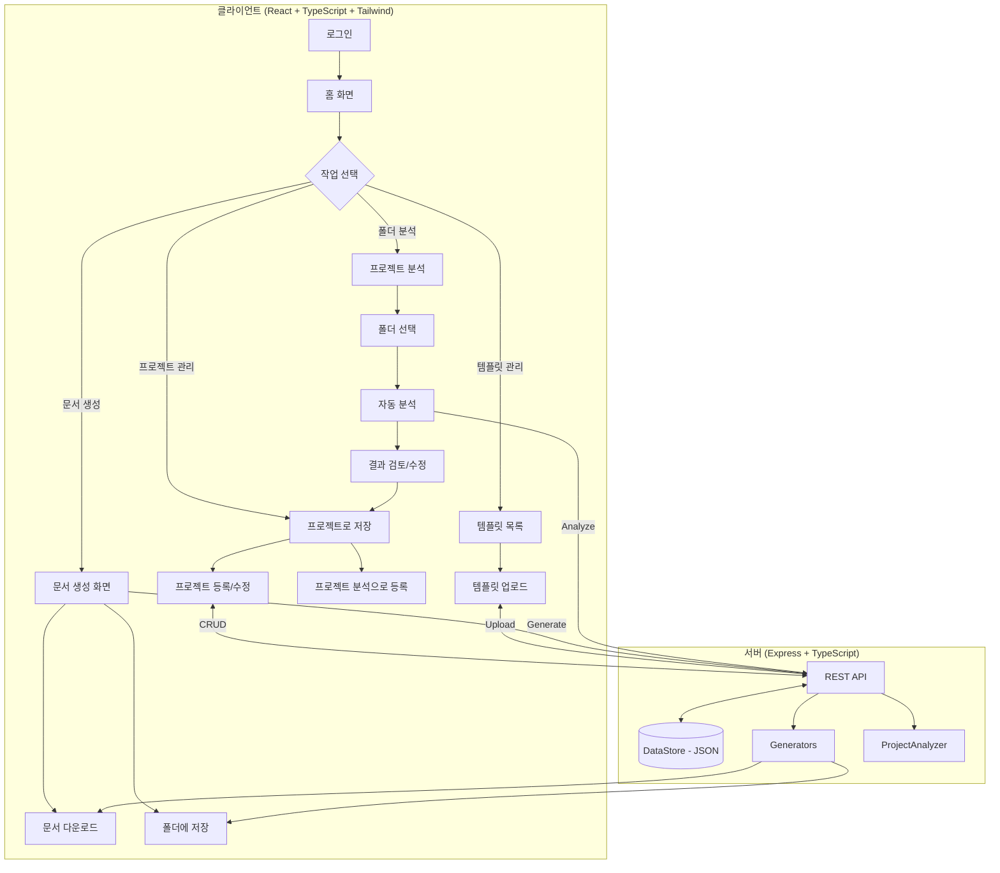

---

## 2. 프로젝트 폴더 분석 프로세스 (신규)

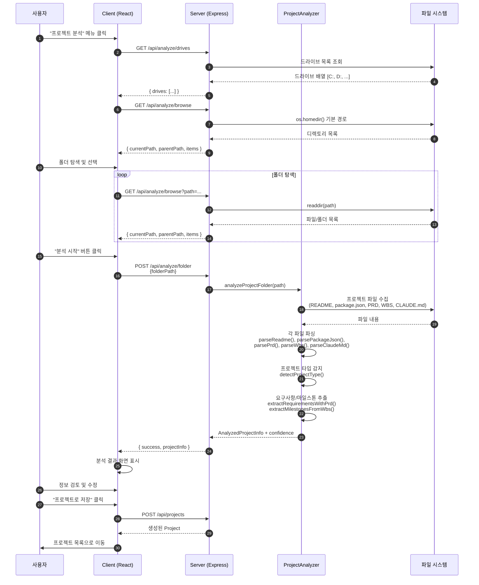

---

## 3. 프로젝트 분석기 내부 로직

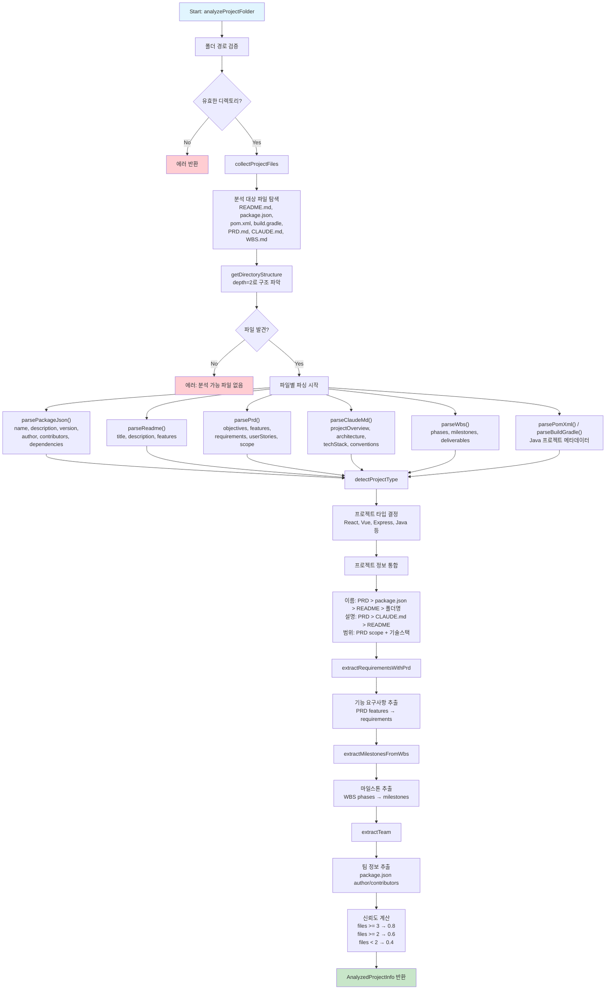

---

## 4. 문서 생성 상세 프로세스

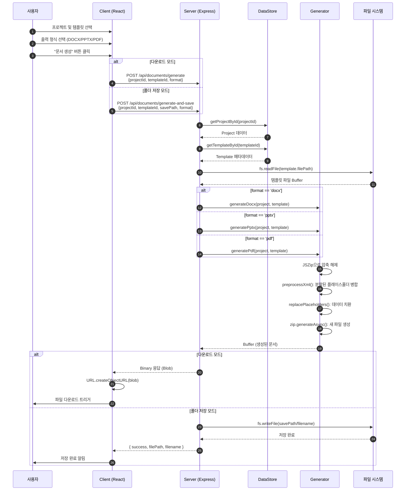

---

## 5. DOCX 생성 내부 프로세스

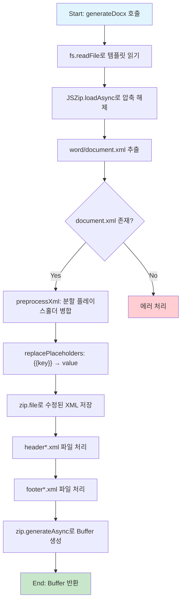

---

## 6. PPTX 생성 내부 프로세스

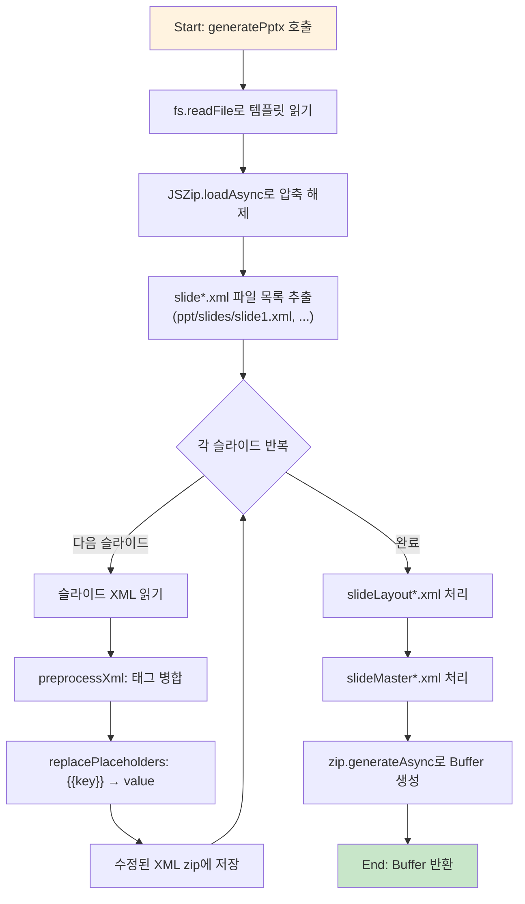

---

## 7. PDF 생성 내부 프로세스 (신규)

```mermaid
flowchart TD
    A[Start: generatePdf 호출] --> B[PDFKit 문서 생성]
    B --> C[폰트 설정<br/>Helvetica 기본]

    C --> D[문서 헤더 작성]
    D --> E["프로젝트 기본 정보<br/>이름, 고객사, 상태, 기간"]

    E --> F[프로젝트 설명 섹션]
    F --> G[수행 범위 섹션]

    G --> H{팀 구성 있음?}
    H -->|Yes| I[팀 구성 테이블 생성]
    H -->|No| J[건너뛰기]

    I --> K{마일스톤 있음?}
    J --> K
    K -->|Yes| L[마일스톤 목록 생성]
    K -->|No| M[건너뛰기]

    L --> N{요구사항 있음?}
    M --> N
    N -->|Yes| O[요구사항 섹션 생성<br/>기능/비기능]
    N -->|No| P[건너뛰기]

    O --> Q[doc.end()로 문서 완료]
    P --> Q
    Q --> R[Buffer 스트림으로 변환]
    R --> S[End: Buffer 반환]

    style A fill:#fce4ec
    style S fill:#c8e6c9
```

---

## 8. 템플릿 업로드 프로세스

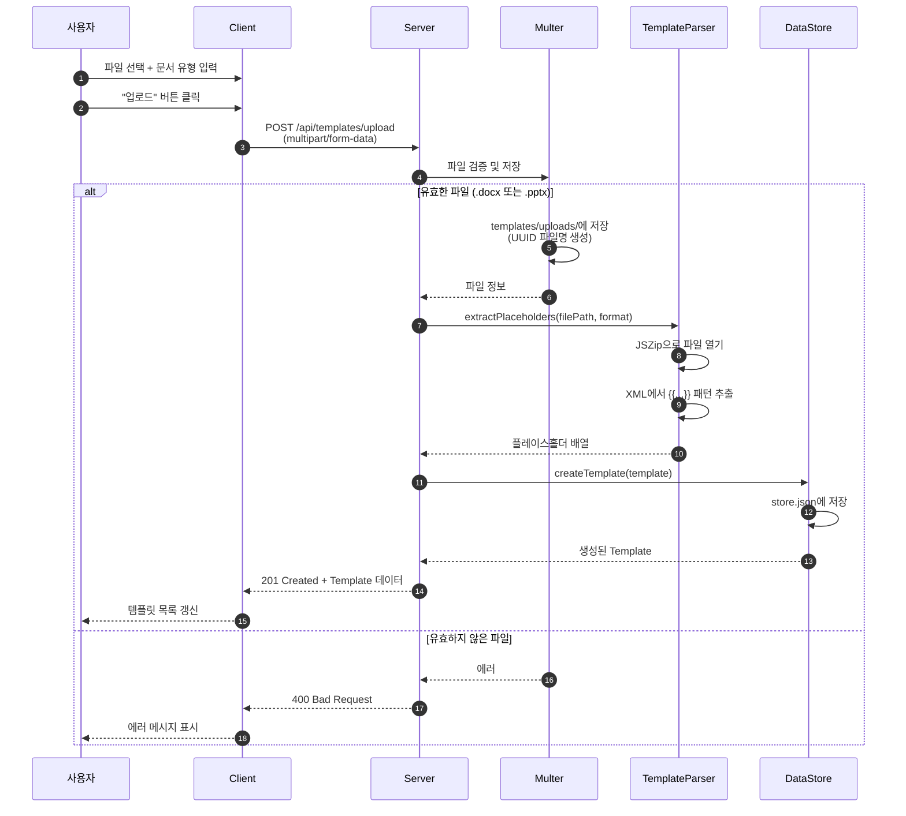

---

## 9. 플레이스홀더 치환 상세

```mermaid
flowchart LR
    subgraph Input["입력 (XML 원본)"]
        A["&lt;w:r&gt;<br/>&lt;w:t&gt;{&#123;&lt;/w:t&gt;<br/>&lt;/w:r&gt;<br/>&lt;w:r&gt;<br/>&lt;w:t&gt;프로젝트&lt;/w:t&gt;<br/>&lt;/w:r&gt;<br/>&lt;w:r&gt;<br/>&lt;w:t&gt;명}&#125;&lt;/w:t&gt;<br/>&lt;/w:r&gt;"]
    end

    subgraph Process["preprocessXml 처리"]
        B["&lt;w:r&gt; 태그 파싱"]
        C["텍스트 연결:<br/>'&#123;&#123;' + '프로젝트' + '명&#125;&#125;'"]
        D["병합된 &lt;w:t&gt; 생성"]
    end

    subgraph Output["출력 (처리된 XML)"]
        E["&lt;w:r&gt;<br/>&lt;w:t&gt;&#123;&#123;프로젝트명&#125;&#125;&lt;/w:t&gt;<br/>&lt;/w:r&gt;"]
    end

    subgraph Replace["replacePlaceholders"]
        F["정규식: /\\{\\{([^}]+)\\}\\}/g"]
        G["keyMap 조회"]
        H["값으로 치환"]
    end

    subgraph Final["최종 결과"]
        I["&lt;w:r&gt;<br/>&lt;w:t&gt;동국제강 스마트 팩토리&lt;/w:t&gt;<br/>&lt;/w:r&gt;"]
    end

    A --> B --> C --> D --> E
    E --> F --> G --> H --> I
```

---

## 10. 데이터 저장 구조

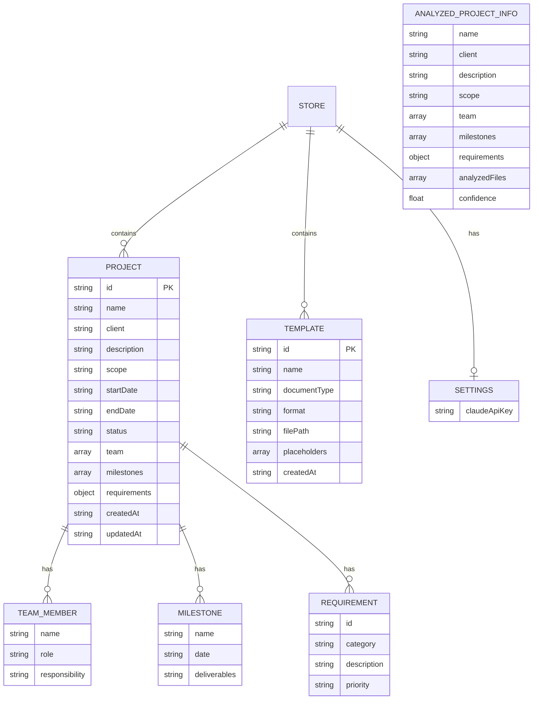

---

## 11. API 엔드포인트 목록

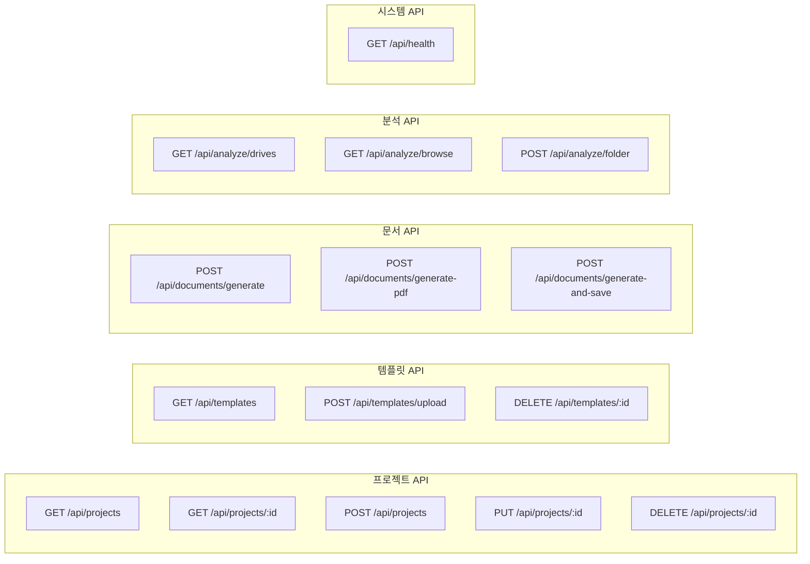

| Method | Endpoint | Description |
|--------|----------|-------------|
| GET | /api/projects | 모든 프로젝트 조회 |
| GET | /api/projects/:id | 프로젝트 상세 조회 |
| POST | /api/projects | 프로젝트 생성 |
| PUT | /api/projects/:id | 프로젝트 수정 |
| DELETE | /api/projects/:id | 프로젝트 삭제 |
| GET | /api/templates | 모든 템플릿 조회 |
| POST | /api/templates/upload | 템플릿 업로드 (multipart) |
| DELETE | /api/templates/:id | 템플릿 삭제 |
| POST | /api/documents/generate | 문서 생성 (다운로드) |
| POST | /api/documents/generate-pdf | PDF 생성 |
| POST | /api/documents/generate-and-save | 문서 생성 후 저장 |
| GET | /api/analyze/drives | 드라이브 목록 조회 |
| GET | /api/analyze/browse | 디렉토리 탐색 |
| POST | /api/analyze/folder | 프로젝트 폴더 분석 |
| GET | /api/health | 서버 상태 확인 |

---

## 12. 에러 핸들링 흐름

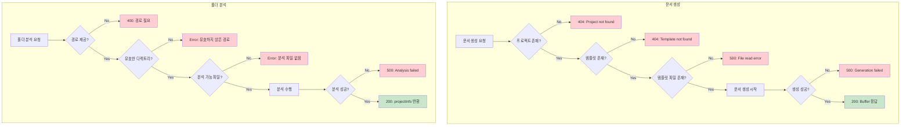

---

## 13. 클라이언트 라우팅 구조

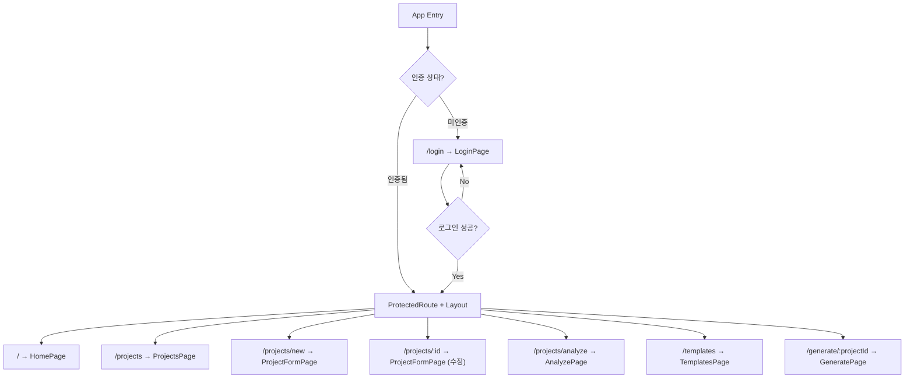

---

## 14. 사용자 여정 맵

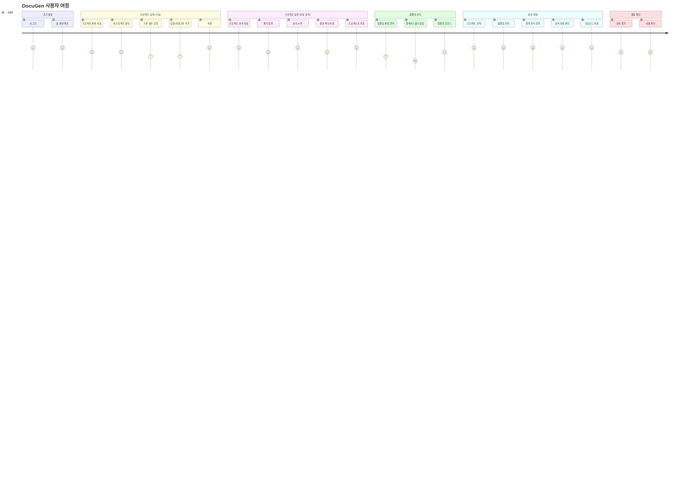

---

## 15. 분석 파일 우선순위

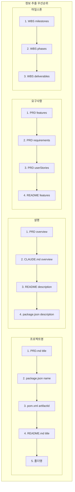

---

## 16. 지원 프로젝트 타입

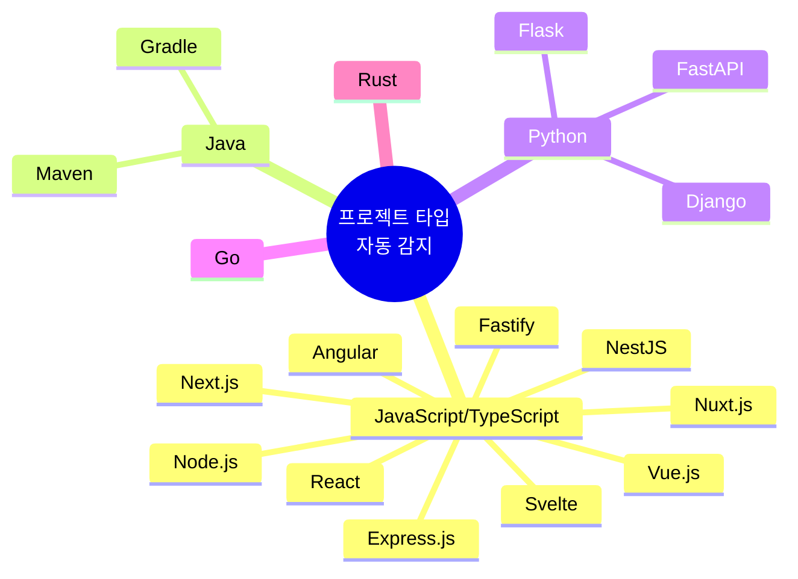

---

*다이어그램 도구: Mermaid.js*
*최종 업데이트: 2024.12.21*
*버전: 2.0 - 프로젝트 분석 기능 추가*
